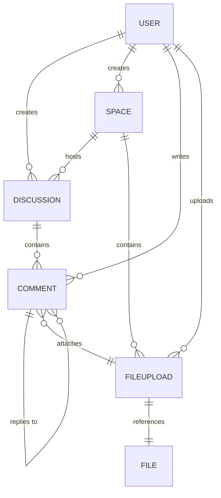

# Collaboration Subdomain

The **Collaboration** subdomain handles how users collaborate, communicate, and
share resources inside the platform. It focuses on Spaces (container for
collaboration), Discussions (threads of communication), Comments (user
contributions), and File management (uploads and attachments). Its goal is to
enable interaction between users, structure conversations and manage content in
a collaborative context.

## Entities

- **Space**: Container for collaboration, where discussions and files can exist.
- **Discussion**: Conversation threads created within a Space.
- **FileUpload**: metadata describing an uploaded file (who uploaded it, when, etc).
- **Comment**: User contributions inside a discussion.
- **File**: The stored resource itself (referenced by FileUpload).
- **User**: External entity (from Identity & Access) linked as a participant.

## Relationships

- A User can create many Discussions.
- A Discussion contains many Comments.
- A Comment can reply to another Comment (self relationship).
- A User can write many Comments.
- A User can perform many FileUploads.
- A Comment may attach one FileUpload.
- A FileUpload references exactly one File.
- A Space can host many Discussions.
- A Space can contain many FileUploads.

## Domain Diagram

