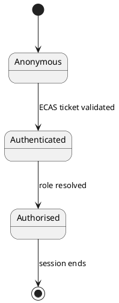

# Authentication flow

Access to the portal is delegated to **ECAS** (the identity provider). The portal
never stores passwords: it validates an ECAS ticket, resolves the user's role
through the authorisation service, and scopes every page to that role.

The diagram below is rendered from a `.puml` file at build time by the PlantUML
remark plugin (`src/remark/plantuml-inline.mjs`) and embedded as an inline SVG.
It is intentionally wide, so it doubles as a test of landscape diagram rendering
in the exported PDF.

## Inline diagrams

The same plugin also renders fenced `plantuml` code blocks, so small diagrams can
live directly in the page:

Both forms produce a self-contained SVG, so the published site and the PDF export
do not depend on the PlantUML server once the build is done.
