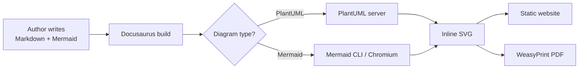

# Authentication


#include "_sections/level-1-context.md"
#include "_sections/level-2-components.md"

you can use a _folder to create reusable md

```
#include "_sections/level-1-context.md"
#include "_sections/level-2-components.md"
```

The full OIDC flow: [C4 Core Diagrams](https://github.com/plantuml-stdlib/C4-PlantUML/blob/master/samples/C4CoreDiagrams.md)


Refresh token detail:

```plantuml
@startuml
!include ../plantuml/_shared/eeas-skin.puml
title Refresh token race condition
...
@enduml
```


