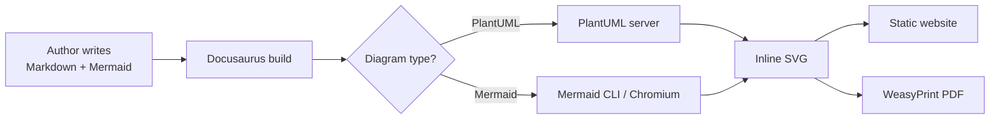

# Authentication


#include "_sections/level-1-context.md"
#include "_sections/level-2-components.md"

you can use a _folder to create reusable md

```
#include "_sections/level-1-context.md"
#include "_sections/level-2-components.md"
```

The full OIDC flow: [C4 Core Diagrams](https://github.com/plantuml-stdlib/C4-PlantUML/blob/master/samples/C4CoreDiagrams.md)


The messages above light up in turn, first to last: the diagram carries a
`' steps` comment, and the build animates its messages in the order they are
written (see `src/remark/plantuml-steps.mjs`). The same comment steps the
links of a component, deployment or C4 diagram — the deployment diagram
further down runs its `Rel()` calls in order, in the EU blue rather than the
default tangerine, from `' steps #004494`: a hex value or a CSS colour name
after the word picks the colour. Nothing is hidden: the PDF shows
the whole exchange at rest, and a reader who asked for reduced motion gets
the still figure. Activity diagrams and C4 *sequence* diagrams are not
grouped by PlantUML and stay still.

Refresh token detail:

```plantuml
@startuml
!include ../plantuml/_shared/eeas-skin.puml
title Refresh token race condition
...
@enduml
```


