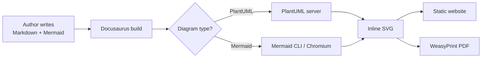

# Executive Summary

This document starts by outlining the architectural design that is specific to this application. Later
sections cover basic architectural design and decisions, many of these are corporate standards. Any
that are specifically different for this application will be highlighted.

## Documentation lifecycle

The diagram below is written in [Mermaid](https://mermaid.js.org/) and is rendered to an
inline SVG at build time, so it appears both on the website and in the generated PDF.

