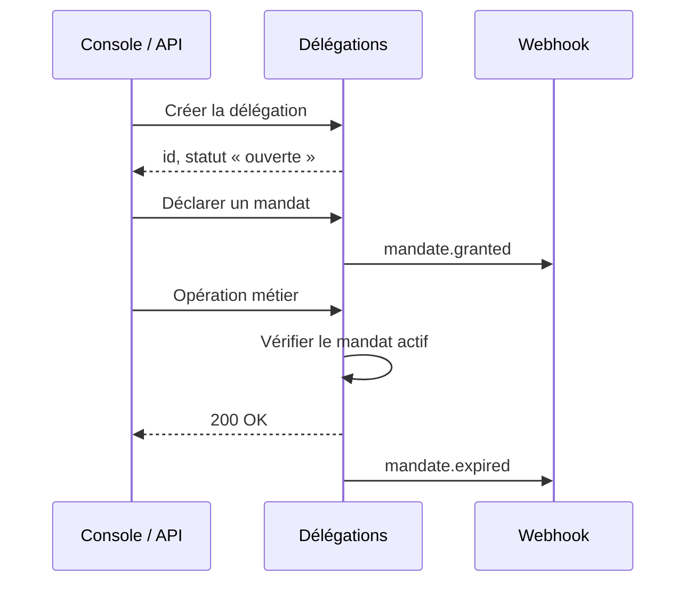

:::lead
Modélisez les délégations de l'Union, leurs mandats et leurs titulaires.
Créez-les depuis la console ou par l'API, suivez leur cycle de vie et
réagissez aux changements par webhooks.
:::

:::actions
- [Démarrage rapide](/docs/intro)
- [Référence API](/docs/api/datamodel/delegations)
:::

:::figure[Product screenshot]{note="console des délégations · 2400×1200" ratio="2 / 1"}
:::

## Ce que vous pouvez faire

:::cards
**Créer et structurer**
Déclarez une délégation, sa zone géographique et sa hiérarchie de rattachement.

**Attribuer des mandats**
Accordez, prolongez ou révoquez un mandat, avec date de prise d'effet.

**Suivre les changements**
Recevez un webhook à chaque transition de statut, journalisée dans l'audit trail.
:::

## Comment ça marche

Quatre étapes, de la création de la délégation à la réaction aux événements.

:::steps
1. **Créer la délégation**
   Un identifiant stable, une zone et un rattachement hiérarchique.
2. **Déclarer les mandats**
   Chaque mandat porte un périmètre, un titulaire et une échéance.
3. **Autoriser les opérations**
   Les appels métier vérifient le mandat actif avant d'agir.
4. **Écouter les événements**
   Statuts, révocations et expirations arrivent par webhook.

:::

## Choisir son intégration

:::option[Console]{badge="Sans code" highlight}
Pour les équipes métier : créer, prolonger et révoquer à la main, avec validation à quatre yeux.

- Aucune mise en œuvre technique
- Journal d'audit intégré
- Export CSV et PDF

[Ouvrir la console](/docs/intro)
:::

:::option[API]{badge="Développeurs"}
Pour automatiser : provisionnement en masse, synchronisation avec l'annuaire, webhooks.

- REST + OpenAPI 3.1
- Clés de test et de production
- Idempotence sur les écritures

[Lire la référence](/docs/api/datamodel/delegations)
:::

## Aller plus loin

:::links
- [Modèle de données](/docs/api/datamodel/delegations) — Champs, types et contraintes
- [Mandats](/docs/api/datamodel/delegations#staffmember) — Création, prolongation, révocation
- [Webhooks](#comment-ça-marche) — Événements et signatures
- [Erreurs](/docs/api/datamodel/delegations#error) — Codes et remédiation
:::
