# Diagrammes Mermaid

Chaque diagramme de cette page est rendu **au build**, pas dans le navigateur.
Un bloc <code>```mermaid</code> est intercepté par un plugin remark
(`src/remark/mermaid-inline.mjs`), rendu en SVG par un Chromium headless, puis
inliné en image data-URL. La page finale ne dépend d'aucun service, et le PDF —
généré par WeasyPrint, qui n'exécute aucun JavaScript — embarque exactement le
même SVG.

Tous les exemples ci-dessous sont rendus avec le thème du site
(`src/remark/mermaid-theme.mjs`) : papier blanc-fumée, encre ardoise, et **un
seul** accent tangerine, dépensé là où le sens est focal.

## Les deux syntaxes

Un bloc de code, pour un diagramme qui vit avec son texte :

````markdown
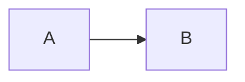
```mermaid
flowchart LR
    A --> B
```
````

Ou un lien image vers un fichier `.mmd` / `.mermaid`, pour un diagramme partagé
entre plusieurs pages :

```markdown

```

---

## Flowchart

Le type le plus courant : un enchaînement d'étapes et de décisions. La forme
porte le sens — rectangle pour une action, losange pour une décision, cylindre
pour un stockage.

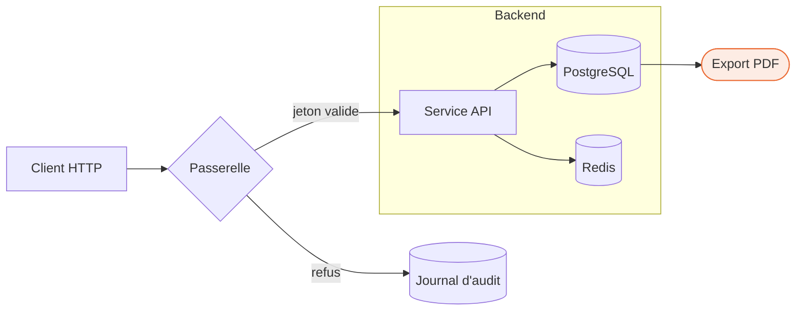
```mermaid
flowchart LR
    classDef focal fill:#fdece4,stroke:#eb6c36,stroke-width:1.2px

    Client[Client HTTP] --> GW{Passerelle}
    GW -->|jeton valide| API[Service API]
    GW -->|refus| Log[(Journal d'audit)]

    subgraph Backend
        API --> DB[(PostgreSQL)]
        API --> Cache[(Redis)]
    end

    DB --> Export([Export PDF])
    Export:::focal
```

<details>
<summary>Source</summary>

```text
flowchart LR
    classDef focal fill:#fdece4,stroke:#eb6c36,stroke-width:1.2px

    Client[Client HTTP] --> GW{Passerelle}
    GW -->|jeton valide| API[Service API]
    GW -->|refus| Log[(Journal d'audit)]

    subgraph Backend
        API --> DB[(PostgreSQL)]
        API --> Cache[(Redis)]
    end

    DB --> Export([Export PDF])
    Export:::focal
```

</details>

Le `classDef focal` ci-dessus est la façon recommandée de **dépenser l'accent** :
un nœud, deux au maximum par diagramme. Au-delà, le signal « voici l'important »
s'efface.

### Orientations

`LR` (gauche → droite), `RL`, `TD` / `TB` (haut → bas), `BT`. Les flux de
traitement se lisent mieux en `LR`, les hiérarchies en `TD`.

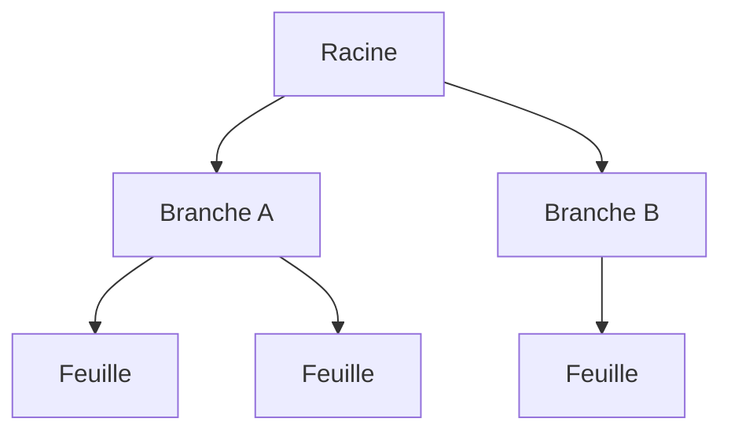
```mermaid
flowchart TD
    Racine --> A[Branche A]
    Racine --> B[Branche B]
    A --> A1[Feuille]
    A --> A2[Feuille]
    B --> B1[Feuille]
```

### Formes

Mermaid 11 expose un catalogue de formes via la syntaxe `@{ shape: … }`, bien
plus large que les crochets historiques.

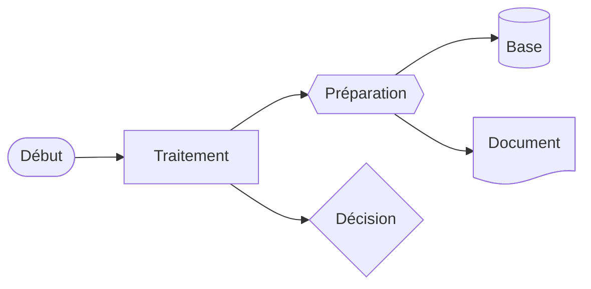
```mermaid
flowchart LR
    A@{ shape: stadium, label: "Début" }
    B@{ shape: rect, label: "Traitement" }
    C@{ shape: hex, label: "Préparation" }
    D@{ shape: cyl, label: "Base" }
    E@{ shape: doc, label: "Document" }
    F@{ shape: diamond, label: "Décision" }

    A --> B --> C --> D
    C --> E
    B --> F
```

<details>
<summary>Source</summary>

```text
flowchart LR
    A@{ shape: stadium, label: "Début" }
    B@{ shape: rect, label: "Traitement" }
    C@{ shape: hex, label: "Préparation" }
    D@{ shape: cyl, label: "Base" }
    E@{ shape: doc, label: "Document" }
    F@{ shape: diamond, label: "Décision" }

    A --> B --> C --> D
    C --> E
    B --> F
```

</details>

### Types de liens

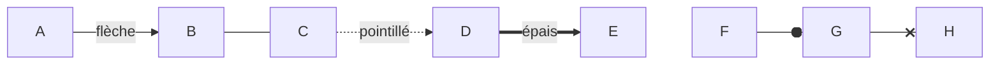
```mermaid
flowchart LR
    A -->|flèche| B
    B --- C
    C -.->|pointillé| D
    D ==>|épais| E
    E ~~~ F
    F --o G
    G --x H
```

---

## Diagramme de séquence

Pour un échange dans le temps entre plusieurs participants : appels d'API,
protocoles d'authentification, chorégraphie de services.

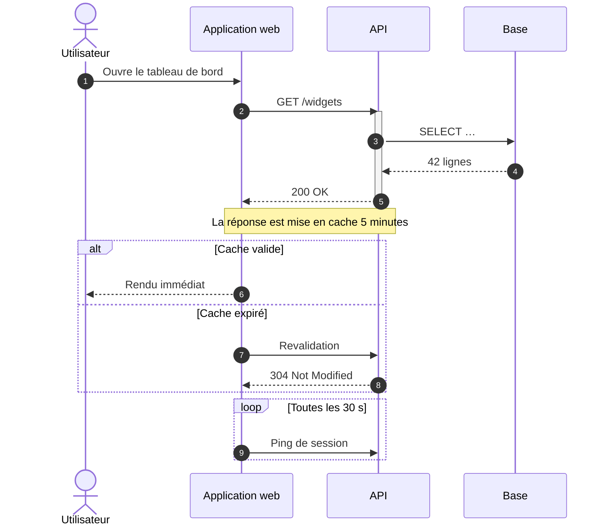
```mermaid
sequenceDiagram
    autonumber
    actor U as Utilisateur
    participant W as Application web
    participant A as API
    participant D as Base

    U->>W: Ouvre le tableau de bord
    W->>A: GET /widgets
    activate A
    A->>D: SELECT …
    D-->>A: 42 lignes
    A-->>W: 200 OK
    deactivate A

    Note over W,A: La réponse est mise en cache 5 minutes

    alt Cache valide
        W-->>U: Rendu immédiat
    else Cache expiré
        W->>A: Revalidation
        A-->>W: 304 Not Modified
    end

    loop Toutes les 30 s
        W->>A: Ping de session
    end
```

<details>
<summary>Source</summary>

```text
sequenceDiagram
    autonumber
    actor U as Utilisateur
    participant W as Application web
    participant A as API
    participant D as Base

    U->>W: Ouvre le tableau de bord
    W->>A: GET /widgets
    activate A
    A->>D: SELECT …
    D-->>A: 42 lignes
    A-->>W: 200 OK
    deactivate A

    Note over W,A: La réponse est mise en cache 5 minutes

    alt Cache valide
        W-->>U: Rendu immédiat
    else Cache expiré
        W->>A: Revalidation
        A-->>W: 304 Not Modified
    end

    loop Toutes les 30 s
        W->>A: Ping de session
    end
```

</details>

La `Note` prend l'accent tangerine : c'est le seul élément d'un diagramme de
séquence qu'un auteur ajoute *pour attirer l'œil*.

---

## Diagramme de classes

La structure d'un modèle objet : attributs, méthodes, visibilité, héritage,
composition.

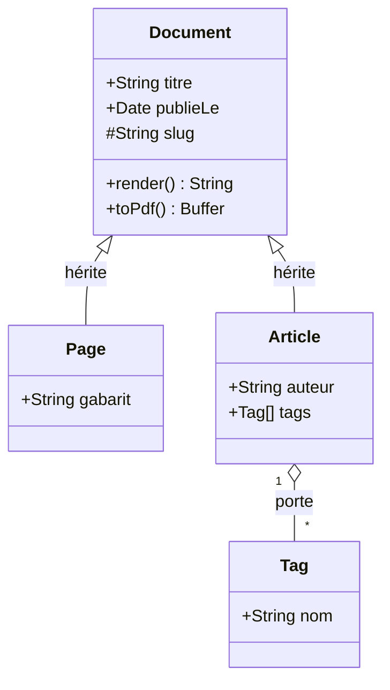
```mermaid
classDiagram
    class Document {
        +String titre
        +Date publieLe
        #String slug
        +render() String
        +toPdf() Buffer
    }

    class Page {
        +String gabarit
    }

    class Article {
        +String auteur
        +Tag[] tags
    }

    class Tag {
        +String nom
    }

    Document <|-- Page : hérite
    Document <|-- Article : hérite
    Article "1" o-- "*" Tag : porte
```

<details>
<summary>Source</summary>

```text
classDiagram
    class Document {
        +String titre
        +Date publieLe
        #String slug
        +render() String
        +toPdf() Buffer
    }

    class Page {
        +String gabarit
    }

    class Article {
        +String auteur
        +Tag[] tags
    }

    class Tag {
        +String nom
    }

    Document <|-- Page : hérite
    Document <|-- Article : hérite
    Article "1" o-- "*" Tag : porte
```

</details>

---

## Diagramme d'états

Le cycle de vie d'une entité : quels états existent, et par quelle transition on
passe de l'un à l'autre.

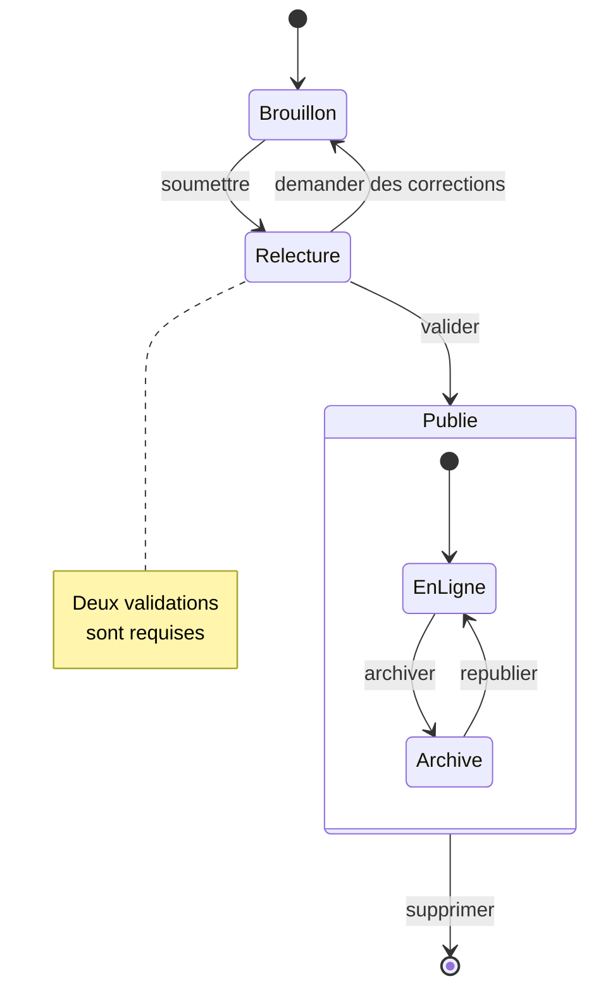
```mermaid
stateDiagram-v2
    [*] --> Brouillon

    Brouillon --> Relecture : soumettre
    Relecture --> Brouillon : demander des corrections
    Relecture --> Publie : valider

    state Publie {
        [*] --> EnLigne
        EnLigne --> Archive : archiver
        Archive --> EnLigne : republier
    }

    Publie --> [*] : supprimer

    note right of Relecture
        Deux validations
        sont requises
    end note
```

<details>
<summary>Source</summary>

```text
stateDiagram-v2
    [*] --> Brouillon

    Brouillon --> Relecture : soumettre
    Relecture --> Brouillon : demander des corrections
    Relecture --> Publie : valider

    state Publie {
        [*] --> EnLigne
        EnLigne --> Archive : archiver
        Archive --> EnLigne : republier
    }

    Publie --> [*] : supprimer

    note right of Relecture
        Deux validations
        sont requises
    end note
```

</details>

---

## Diagramme entité-relation

Le schéma d'une base : tables, colonnes, clés et cardinalités.

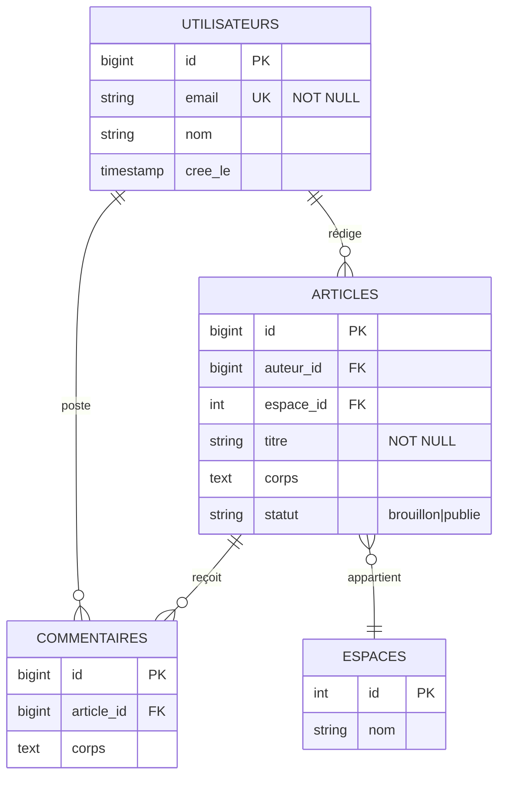
```mermaid
erDiagram
    UTILISATEURS ||--o{ ARTICLES : rédige
    UTILISATEURS ||--o{ COMMENTAIRES : poste
    ARTICLES ||--o{ COMMENTAIRES : reçoit
    ARTICLES }o--|| ESPACES : appartient

    UTILISATEURS {
        bigint id PK
        string email UK "NOT NULL"
        string nom
        timestamp cree_le
    }

    ARTICLES {
        bigint id PK
        bigint auteur_id FK
        int espace_id FK
        string titre "NOT NULL"
        text corps
        string statut "brouillon|publie"
    }

    COMMENTAIRES {
        bigint id PK
        bigint article_id FK
        text corps
    }

    ESPACES {
        int id PK
        string nom
    }
```

<details>
<summary>Source</summary>

```text
erDiagram
    UTILISATEURS ||--o{ ARTICLES : rédige
    UTILISATEURS ||--o{ COMMENTAIRES : poste
    ARTICLES ||--o{ COMMENTAIRES : reçoit
    ARTICLES }o--|| ESPACES : appartient

    UTILISATEURS {
        bigint id PK
        string email UK "NOT NULL"
        string nom
        timestamp cree_le
    }

    ARTICLES {
        bigint id PK
        bigint auteur_id FK
        int espace_id FK
        string titre "NOT NULL"
        text corps
        string statut "brouillon|publie"
    }

    COMMENTAIRES {
        bigint id PK
        bigint article_id FK
        text corps
    }

    ESPACES {
        int id PK
        string nom
    }
```

</details>

---

## Gantt

Un planning : phases, durées, dépendances, chemin critique. Les tâches marquées
`crit` prennent l'accent.

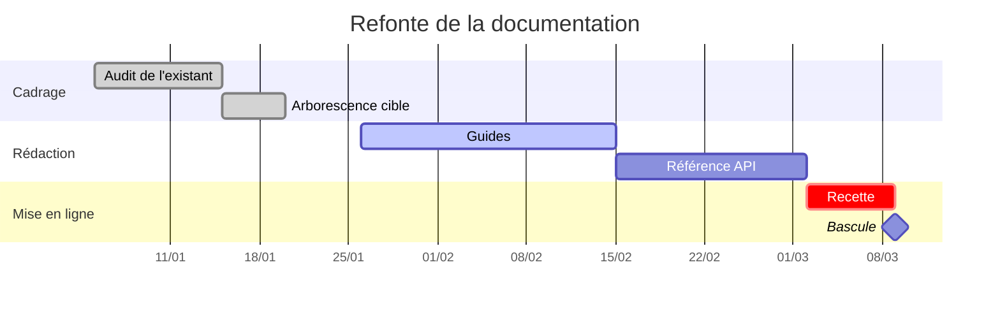
```mermaid
gantt
    title Refonte de la documentation
    dateFormat YYYY-MM-DD
    axisFormat %d/%m

    section Cadrage
        Audit de l'existant      :done,   a1, 2026-01-05, 10d
        Arborescence cible       :done,   a2, after a1, 5d

    section Rédaction
        Guides                   :active, b1, 2026-01-26, 20d
        Référence API            :        b2, after b1, 15d

    section Mise en ligne
        Recette                  :crit,   c1, after b2, 7d
        Bascule                  :milestone, c2, after c1, 0d
```

<details>
<summary>Source</summary>

```text
gantt
    title Refonte de la documentation
    dateFormat YYYY-MM-DD
    axisFormat %d/%m

    section Cadrage
        Audit de l'existant      :done,   a1, 2026-01-05, 10d
        Arborescence cible       :done,   a2, after a1, 5d

    section Rédaction
        Guides                   :active, b1, 2026-01-26, 20d
        Référence API            :        b2, after b1, 15d

    section Mise en ligne
        Recette                  :crit,   c1, after b2, 7d
        Bascule                  :milestone, c2, after c1, 0d
```

</details>

---

## Camembert

Une répartition, quand les parts sont peu nombreuses et franchement
différentes. La première part prend l'accent.

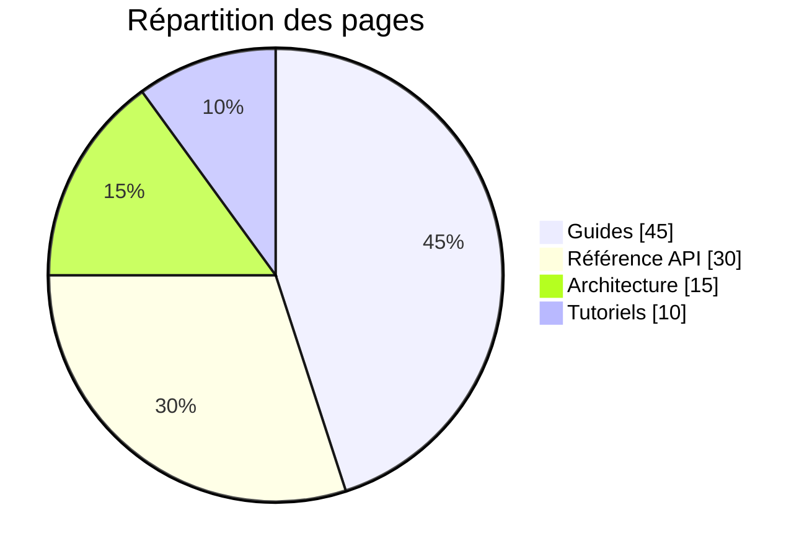
```mermaid
pie showData
    title Répartition des pages
    "Guides" : 45
    "Référence API" : 30
    "Architecture" : 15
    "Tutoriels" : 10
```

---

## Quadrant

Positionner des options sur deux axes — effort contre valeur, risque contre
impact.

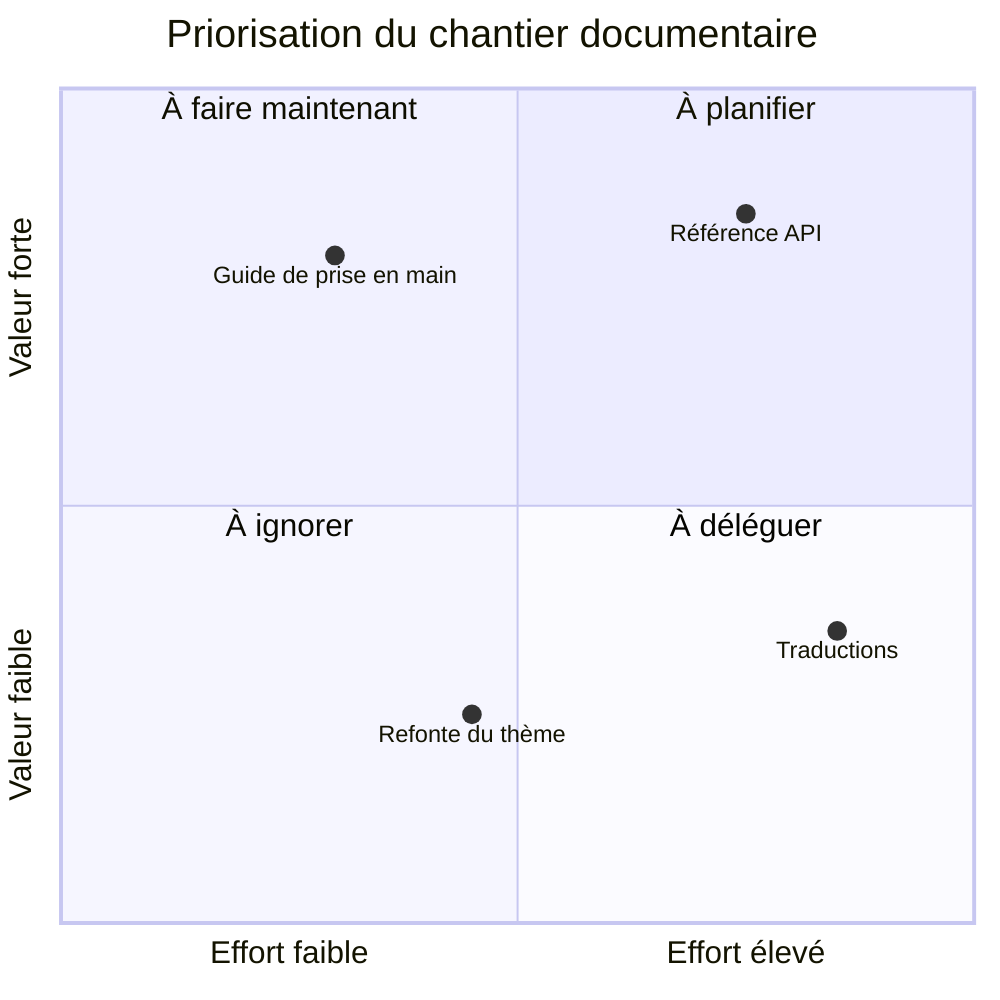
```mermaid
quadrantChart
    title Priorisation du chantier documentaire
    x-axis "Effort faible" --> "Effort élevé"
    y-axis "Valeur faible" --> "Valeur forte"
    quadrant-1 À planifier
    quadrant-2 À faire maintenant
    quadrant-3 À ignorer
    quadrant-4 À déléguer
    "Référence API": [0.75, 0.85]
    "Guide de prise en main": [0.30, 0.80]
    "Traductions": [0.85, 0.35]
    "Refonte du thème": [0.45, 0.25]
```

<details>
<summary>Source</summary>

```text
quadrantChart
    title Priorisation du chantier documentaire
    x-axis "Effort faible" --> "Effort élevé"
    y-axis "Valeur faible" --> "Valeur forte"
    quadrant-1 À planifier
    quadrant-2 À faire maintenant
    quadrant-3 À ignorer
    quadrant-4 À déléguer
    "Référence API": [0.75, 0.85]
    "Guide de prise en main": [0.30, 0.80]
    "Traductions": [0.85, 0.35]
    "Refonte du thème": [0.45, 0.25]
```

</details>

---

## Diagramme d'exigences

Tracer des exigences et ce qui les satisfait ou les vérifie — utile pour un
dossier de conformité.

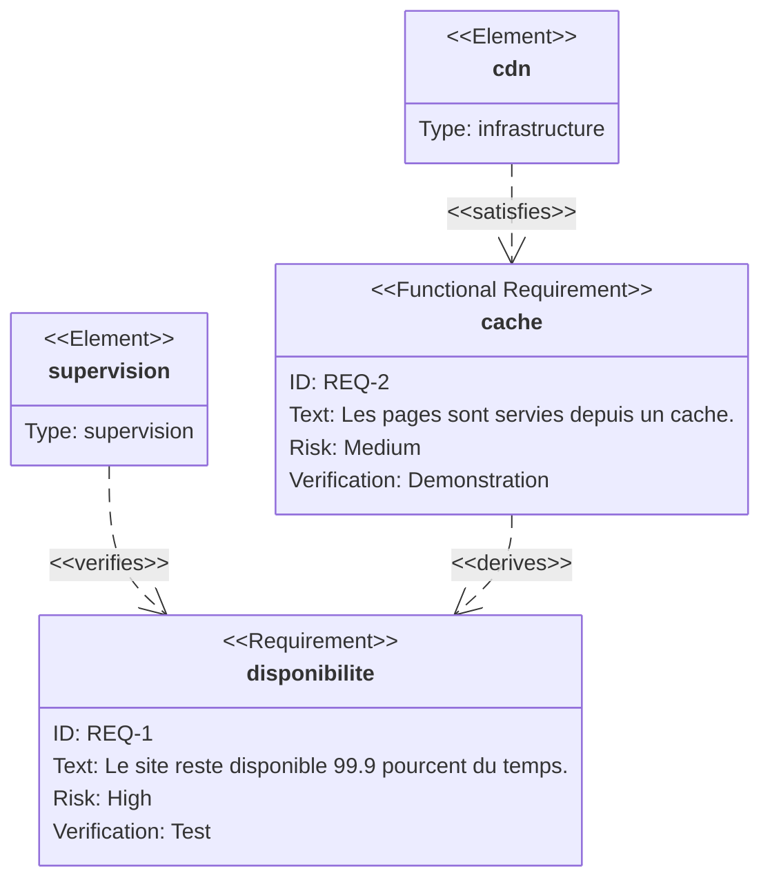
```mermaid
requirementDiagram

requirement disponibilite {
id: "REQ-1"
text: Le site reste disponible 99.9 pourcent du temps.
risk: high
verifymethod: test
}

functionalRequirement cache {
id: "REQ-2"
text: Les pages sont servies depuis un cache.
risk: medium
verifymethod: demonstration
}

element supervision {
type: supervision
}

element cdn {
type: infrastructure
}

cdn - satisfies -> cache
supervision - verifies -> disponibilite
cache - derives -> disponibilite
```

<details>
<summary>Source</summary>

```text
requirementDiagram

requirement disponibilite {
id: "REQ-1"
text: Le site reste disponible 99.9 pourcent du temps.
risk: high
verifymethod: test
}

functionalRequirement cache {
id: "REQ-2"
text: Les pages sont servies depuis un cache.
risk: medium
verifymethod: demonstration
}

element supervision {
type: supervision
}

element cdn {
type: infrastructure
}

cdn - satisfies -> cache
supervision - verifies -> disponibilite
cache - derives -> disponibilite
```

</details>

---

## Git graph

Une stratégie de branches, expliquée par l'exemple.

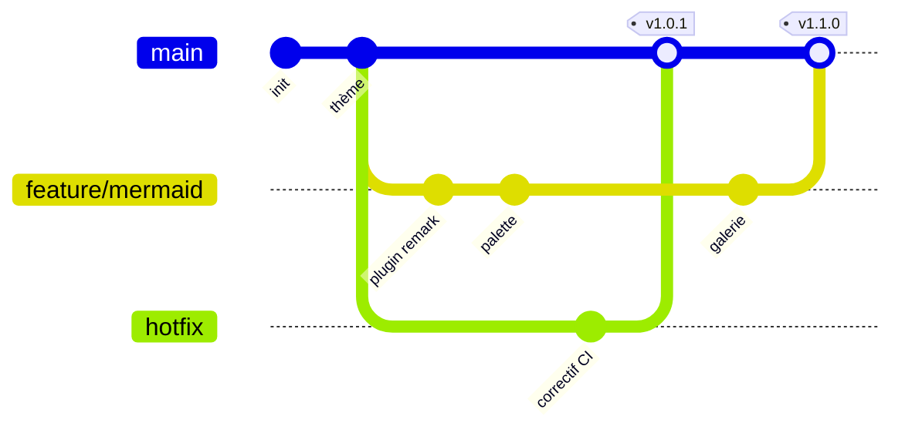
```mermaid
gitGraph
    commit id: "init"
    commit id: "thème"
    branch feature/mermaid
    checkout feature/mermaid
    commit id: "plugin remark"
    commit id: "palette"
    checkout main
    branch hotfix
    commit id: "correctif CI"
    checkout main
    merge hotfix tag: "v1.0.1"
    checkout feature/mermaid
    commit id: "galerie"
    checkout main
    merge feature/mermaid tag: "v1.1.0"
```

<details>
<summary>Source</summary>

```text
gitGraph
    commit id: "init"
    commit id: "thème"
    branch feature/mermaid
    checkout feature/mermaid
    commit id: "plugin remark"
    commit id: "palette"
    checkout main
    branch hotfix
    commit id: "correctif CI"
    checkout main
    merge hotfix tag: "v1.0.1"
    checkout feature/mermaid
    commit id: "galerie"
    checkout main
    merge feature/mermaid tag: "v1.1.0"
```

</details>

---

## C4

Le modèle C4 pour l'architecture : contexte, conteneurs, composants. Utile quand
il faut montrer qui parle à quoi, et par quel protocole.

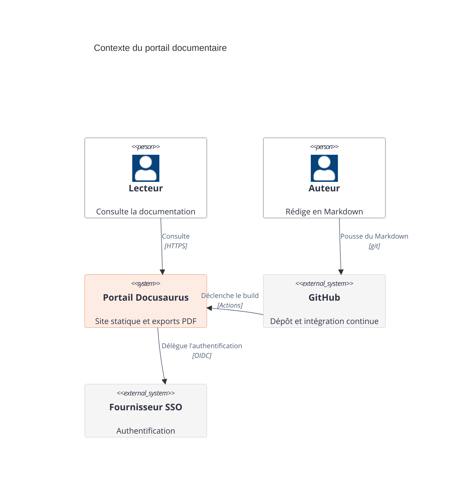
```mermaid
C4Context
    title Contexte du portail documentaire

    Person(lecteur, "Lecteur", "Consulte la documentation")
    Person(auteur, "Auteur", "Rédige en Markdown")

    System(portail, "Portail Docusaurus", "Site statique et exports PDF")

    System_Ext(github, "GitHub", "Dépôt et intégration continue")
    System_Ext(sso, "Fournisseur SSO", "Authentification")

    Rel(lecteur, portail, "Consulte", "HTTPS")
    Rel(auteur, github, "Pousse du Markdown", "git")
    Rel(github, portail, "Déclenche le build", "Actions")
    Rel(portail, sso, "Délègue l'authentification", "OIDC")

    UpdateElementStyle(lecteur, $bgColor="#ffffff", $borderColor="#2d3142", $fontColor="#2d3142")
    UpdateElementStyle(auteur, $bgColor="#ffffff", $borderColor="#2d3142", $fontColor="#2d3142")
    UpdateElementStyle(portail, $bgColor="#fdece4", $borderColor="#eb6c36", $fontColor="#2d3142")
    UpdateElementStyle(github, $bgColor="#f5f5f5", $borderColor="#bfc0c0", $fontColor="#2d3142")
    UpdateElementStyle(sso, $bgColor="#f5f5f5", $borderColor="#bfc0c0", $fontColor="#2d3142")

    UpdateRelStyle(lecteur, portail, $textColor="#4f5d75", $lineColor="#4f5d75", $offsetY="-20")
    UpdateRelStyle(auteur, github, $textColor="#4f5d75", $lineColor="#4f5d75", $offsetY="-20")
    UpdateRelStyle(github, portail, $textColor="#4f5d75", $lineColor="#4f5d75", $offsetY="-30", $offsetX="-60")
    UpdateRelStyle(portail, sso, $textColor="#4f5d75", $lineColor="#4f5d75", $offsetY="-20")
```

<details>
<summary>Source</summary>

```text
C4Context
    title Contexte du portail documentaire

    Person(lecteur, "Lecteur", "Consulte la documentation")
    Person(auteur, "Auteur", "Rédige en Markdown")

    System(portail, "Portail Docusaurus", "Site statique et exports PDF")

    System_Ext(github, "GitHub", "Dépôt et intégration continue")
    System_Ext(sso, "Fournisseur SSO", "Authentification")

    Rel(lecteur, portail, "Consulte", "HTTPS")
    Rel(auteur, github, "Pousse du Markdown", "git")
    Rel(github, portail, "Déclenche le build", "Actions")
    Rel(portail, sso, "Délègue l'authentification", "OIDC")

    UpdateElementStyle(lecteur, $bgColor="#ffffff", $borderColor="#2d3142", $fontColor="#2d3142")
    UpdateElementStyle(auteur, $bgColor="#ffffff", $borderColor="#2d3142", $fontColor="#2d3142")
    UpdateElementStyle(portail, $bgColor="#fdece4", $borderColor="#eb6c36", $fontColor="#2d3142")
    UpdateElementStyle(github, $bgColor="#f5f5f5", $borderColor="#bfc0c0", $fontColor="#2d3142")
    UpdateElementStyle(sso, $bgColor="#f5f5f5", $borderColor="#bfc0c0", $fontColor="#2d3142")

    UpdateRelStyle(lecteur, portail, $textColor="#4f5d75", $lineColor="#4f5d75", $offsetY="-20")
    UpdateRelStyle(auteur, github, $textColor="#4f5d75", $lineColor="#4f5d75", $offsetY="-20")
    UpdateRelStyle(github, portail, $textColor="#4f5d75", $lineColor="#4f5d75", $offsetY="-30", $offsetX="-60")
    UpdateRelStyle(portail, sso, $textColor="#4f5d75", $lineColor="#4f5d75", $offsetY="-20")
```

</details>

C4 n'hérite que partiellement du thème du site : Mermaid y code ses bleus en
dur, et le thème ne peut reprendre la main que sur quelques clés. Les directives
`UpdateElementStyle` et `UpdateRelStyle` ci-dessus font le reste — c'est aussi
comme cela qu'on désigne le système focal, ici le portail, en tangerine. Seul le
pictogramme des personnes garde son bleu d'origine.

---

## Carte mentale

Pour dégrossir un périmètre, ou donner le plan d'un site en un coup d'œil.

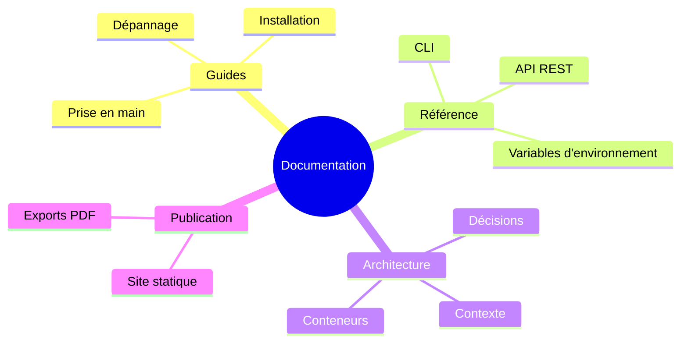
```mermaid
mindmap
    root((Documentation))
        Guides
            Prise en main
            Installation
            Dépannage
        Référence
            API REST
            CLI
            Variables d'environnement
        Architecture
            Contexte
            Conteneurs
            Décisions
        Publication
            Site statique
            Exports PDF
```

---

## Frise chronologique

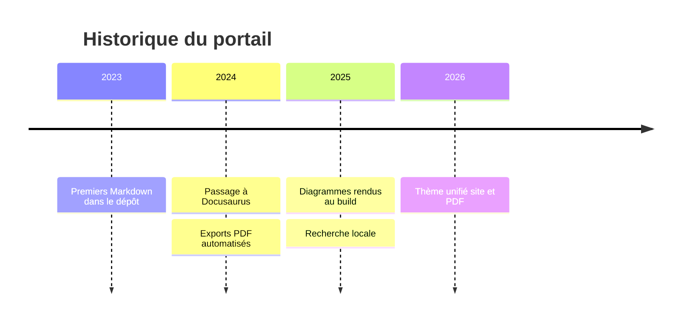
```mermaid
timeline
    title Historique du portail
    2023 : Premiers Markdown dans le dépôt
    2024 : Passage à Docusaurus
         : Exports PDF automatisés
    2025 : Diagrammes rendus au build
         : Recherche locale
    2026 : Thème unifié site et PDF
```

---

## Sankey

Des flux et leurs volumes : d'où vient le trafic, où il se perd.

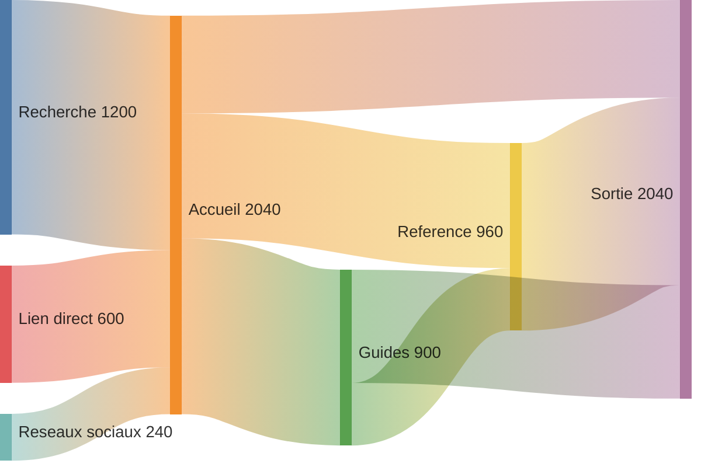
```mermaid
sankey-beta

"Recherche","Accueil",1200
"Lien direct","Accueil",600
"Reseaux sociaux","Accueil",240
"Accueil","Guides",900
"Accueil","Reference",640
"Accueil","Sortie",500
"Guides","Reference",320
"Guides","Sortie",580
"Reference","Sortie",960
```

---

## Graphique XY

Barres et courbes sur un même repère, pour une série chiffrée.

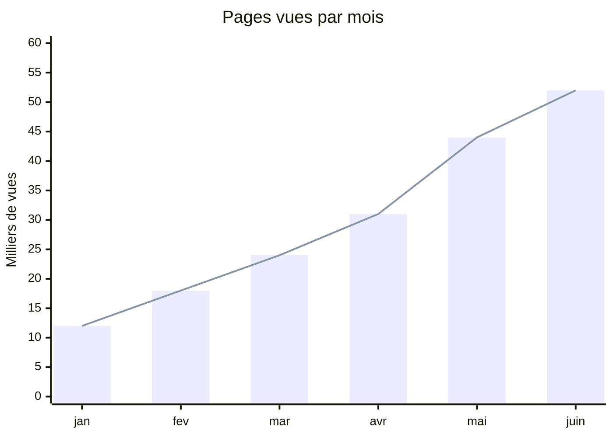
```mermaid
xychart-beta
    title "Pages vues par mois"
    x-axis ["jan", "fev", "mar", "avr", "mai", "juin"]
    y-axis "Milliers de vues" 0 --> 60
    bar [12, 18, 24, 31, 44, 52]
    line [12, 18, 24, 31, 44, 52]
```

---

## Block

Une disposition en grille, quand la position compte plus que les liens : couches
d'une architecture, découpage d'un écran.

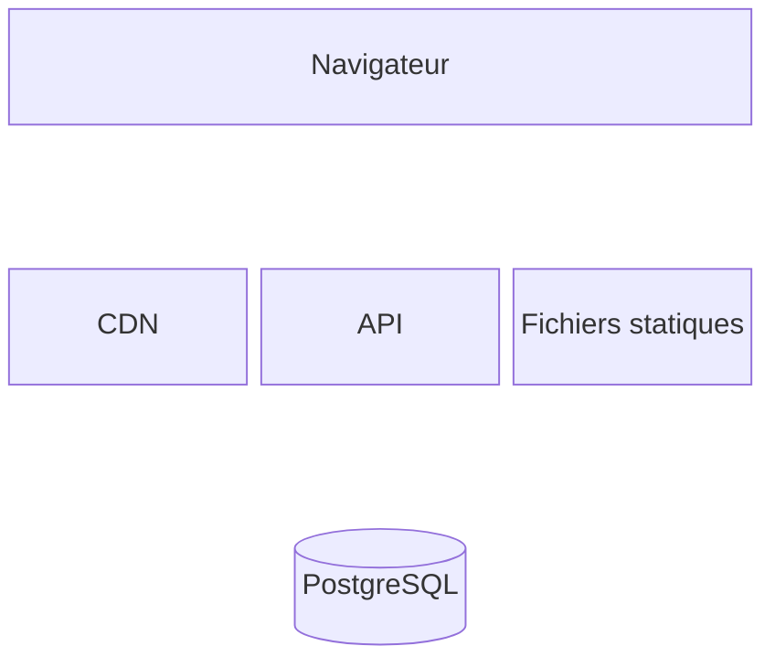
```mermaid
block-beta
    columns 3

    navigateur["Navigateur"]:3
    space:3
    cdn["CDN"] api["API"] statique["Fichiers statiques"]
    space:3
    db[("PostgreSQL")]:3
```

<details>
<summary>Source</summary>

```text
block-beta
    columns 3

    navigateur["Navigateur"]:3
    space:3
    cdn["CDN"] api["API"] statique["Fichiers statiques"]
    space:3
    db[("PostgreSQL")]:3
```

</details>

---

## Packet

La structure binaire d'un en-tête ou d'une trame, bit à bit.

```mermaid
packet-beta
    0-15: "Port source"
    16-31: "Port destination"
    32-63: "Numéro de séquence"
    64-95: "Numéro d'acquittement"
    96-99: "Offset"
    100-105: "Réservé"
    106-111: "Drapeaux"
    112-127: "Fenêtre"
```

---

## Kanban

L'état d'un tableau de travail, figé dans la documentation.

```mermaid
kanban
    À faire
        t1[Traduire les guides]
        t2[Documenter le CLI]
    En cours
        t3[Galerie de diagrammes]
    Terminé
        t4[Thème unifié]
        t5[Exports PDF]
```

---

## Architecture

Services et groupes, avec les icônes intégrées (`cloud`, `database`, `disk`,
`internet`, `server`).

```mermaid
architecture-beta
    group public(internet)[Public]
    group prive(cloud)[Prive]

    service navigateur(internet)[Navigateur] in public
    service cdn(server)[CDN] in public
    service api(server)[API] in prive
    service base(database)[PostgreSQL] in prive
    service fichiers(disk)[Stockage] in prive

    navigateur:R --> L:cdn
    cdn:R --> L:api
    api:R --> L:base
    api:B --> T:fichiers
```

<details>
<summary>Source</summary>

```text
architecture-beta
    group public(internet)[Public]
    group prive(cloud)[Prive]

    service navigateur(internet)[Navigateur] in public
    service cdn(server)[CDN] in public
    service api(server)[API] in prive
    service base(database)[PostgreSQL] in prive
    service fichiers(disk)[Stockage] in prive

    navigateur:R --> L:cdn
    cdn:R --> L:api
    api:R --> L:base
    api:B --> T:fichiers
```

</details>

Les arêtes et les cadres de groupe suivent le thème ; les **icônes**, elles,
viennent du jeu d'icônes de Mermaid et gardent leur bleu. C'est le seul endroit
de la page où une couleur échappe au système.

---

## Radar

Comparer plusieurs profils sur les mêmes critères.

```mermaid
radar-beta
    axis lisibilite["Lisibilité"], fraicheur["Fraîcheur"], couverture["Couverture"]
    axis exemples["Exemples"], recherche["Recherche"]
    curve avant["Avant refonte"]{60, 40, 55, 30, 45}
    curve apres["Après refonte"]{85, 80, 75, 90, 80}
    max 100
```

<details>
<summary>Source</summary>

```text
radar-beta
    axis lisibilite["Lisibilité"], fraicheur["Fraîcheur"], couverture["Couverture"]
    axis exemples["Exemples"], recherche["Recherche"]
    curve avant["Avant refonte"]{60, 40, 55, 30, 45}
    curve apres["Après refonte"]{85, 80, 75, 90, 80}
    max 100
```

</details>

---

## Treemap

Des proportions imbriquées : le poids de chaque section, et de quoi elle est
faite.

```mermaid
treemap-beta
    "Documentation"
        "Guides"
            "Prise en main": 18
            "Installation": 12
            "Dépannage": 9
        "Référence"
            "API REST": 22
            "CLI": 8
        "Architecture"
            "Décisions": 14
            "Vues C4": 6
```

<details>
<summary>Source</summary>

```text
treemap-beta
    "Documentation"
        "Guides"
            "Prise en main": 18
            "Installation": 12
            "Dépannage": 9
        "Référence"
            "API REST": 22
            "CLI": 8
        "Architecture"
            "Décisions": 14
            "Vues C4": 6
```

</details>

---

## ZenUML

Une seconde syntaxe de séquence, plus proche du code — pratique quand le
diagramme est dérivé d'une implémentation.

```mermaid
zenuml
    title Création d'un article
    @Actor Auteur
    @Boundary API
    @Database Base

    Auteur->API.creer(article) {
        API->Base.insert(article) {
            return id
        }
        return 201
    }
```

<details>
<summary>Source</summary>

```text
zenuml
    title Création d'un article
    @Actor Auteur
    @Boundary API
    @Database Base

    Auteur->API.creer(article) {
        API->Base.insert(article) {
            return id
        }
        return 201
    }
```

</details>

---

## Limites du pipeline

Quatre choses à connaître avant d'écrire un diagramme ici. Elles découlent
toutes du même choix : un seul SVG sert le site **et** le PDF.

### Le parcours utilisateur (`journey`) n'est pas utilisable

C'est le seul type que Mermaid rend avec des éléments `<foreignObject>`, c'est-à-dire
du HTML posé dans le SVG. WeasyPrint ne sait pas les rendre : le diagramme sort
du PDF avec ses boîtes vides, sans aucun texte. Tous les autres types
respectent le réglage `htmlLabels: false` et restent en `<text>` SVG. Pour un
parcours, utiliser une frise chronologique ou un diagramme d'états.

### Certains libellés débordent de leur boîte

Sur les diagrammes entité-relation, de classes et d'états, un libellé long peut
dépasser légèrement son cadre. C'est une limite connue de `htmlLabels: false`,
réglage imposé par le PDF. Le contournement est de raccourcir le libellé, ou
d'en déplacer une partie dans une note.

### Les couleurs se règlent au thème, pas dans le diagramme

Le CSS du site ne peut pas atteindre l'intérieur d'un diagramme : le SVG est
inliné dans une balise ``, que le CSS ne traverse pas. Toute la palette est
donc centralisée dans `src/remark/mermaid-theme.mjs`. Les directives `style` et
`classDef` d'un diagramme restent possibles pour un cas ponctuel — voir le
`classDef focal` du premier exemple — mais tout ce qui est systématique a sa
place dans le thème.

### Un seul accent par diagramme

Le thème réserve le tangerine aux éléments focaux par construction : notes,
tâches critiques, première part d'un camembert. Un diagramme qui met tout en
avant ne met rien en avant : deux nœuds accentués au maximum.

## Si un diagramme ne se rend pas

Le build ne s'arrête pas : le bloc est remplacé par un encadré qui conserve la
source et affiche l'erreur. Cherchez `[mermaid]` dans le journal de build pour
la cause. Pour faire échouer le build à la place — utile en CI — lancez-le avec
`MERMAID_STRICT=1`.
