# Mermaid diagrams

Every diagram on this page is rendered **at build time**, not in the browser.
A <code>```mermaid</code> block is intercepted by a remark plugin
(`src/remark/mermaid-inline.mjs`), rendered to SVG by a headless Chromium, then
inlined as a data-URL image. The published page depends on no service at all,
and the PDF — produced by WeasyPrint, which runs no JavaScript — embeds exactly
the same SVG.

All the examples below use the site theme (`src/remark/mermaid-theme.mjs`):
white paper, slate ink, and **one** tangerine accent, spent where the meaning is
focal. Nodes are white too, so it is their hairlines that draw them — the theme
uses no background fills.

## The two syntaxes

A code block, for a diagram that lives with its text:

````markdown
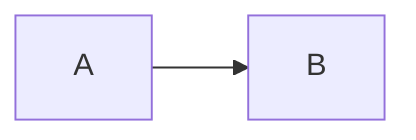
````

Or an image link to a `.mmd` / `.mermaid` file, for a diagram shared across
several pages:

```markdown

```

---

## Flowchart

The most common type: a chain of steps and decisions. Shape carries meaning —
a rectangle for an action, a diamond for a decision, a cylinder for storage.

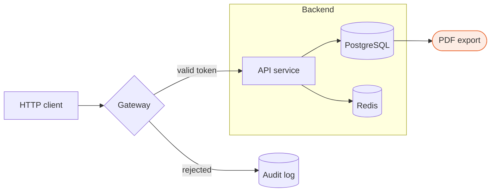

<details>
<summary>Source</summary>

```text
flowchart LR
    classDef focal fill:#fdece4,stroke:#eb6c36,stroke-width:1.2px

    Client[HTTP client] --> GW{Gateway}
    GW -->|valid token| API[API service]
    GW -->|rejected| Log[(Audit log)]

    subgraph Backend
        API --> DB[(PostgreSQL)]
        API --> Cache[(Redis)]
    end

    DB --> Export([PDF export])
    Export:::focal
```

</details>

The `classDef focal` above is the recommended way to **spend the accent**: one
node, two at most per diagram. Beyond that, the "this is what matters" signal
fades.

### Orientations

`LR` (left to right), `RL`, `TD` / `TB` (top down), `BT`. Processing flows read
better in `LR`, hierarchies in `TD`.

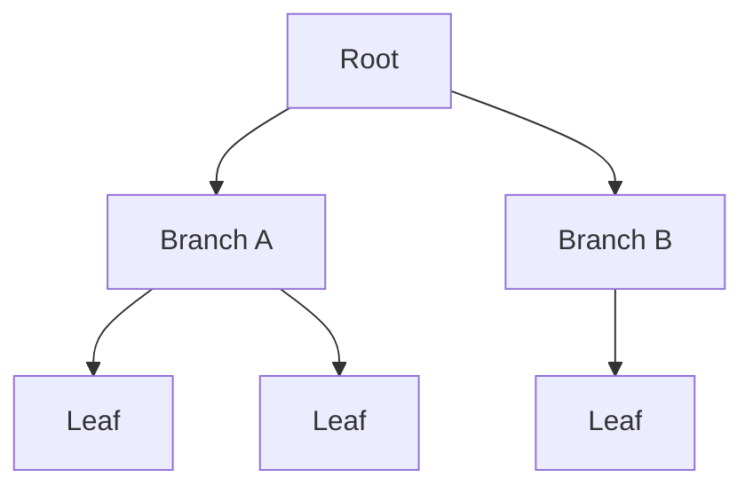

### Shapes

Mermaid 11 exposes a shape catalogue through the `@{ shape: … }` syntax, far
wider than the historical bracket forms.

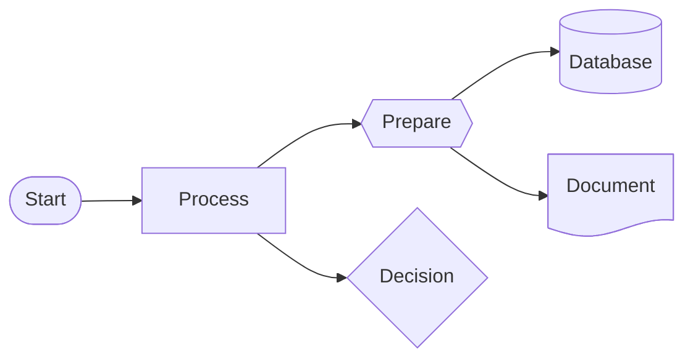

<details>
<summary>Source</summary>

```text
flowchart LR
    A@{ shape: stadium, label: "Start" }
    B@{ shape: rect, label: "Process" }
    C@{ shape: hex, label: "Prepare" }
    D@{ shape: cyl, label: "Database" }
    E@{ shape: doc, label: "Document" }
    F@{ shape: diamond, label: "Decision" }

    A --> B --> C --> D
    C --> E
    B --> F
```

</details>

### Link types

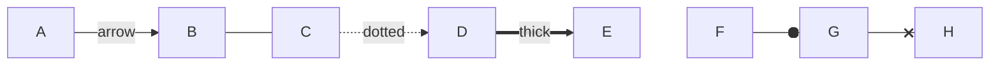

### Animated links

A diagram here is an ``: the page's CSS and scripts stop at its border,
but the CSS **baked into the SVG** runs — and that is where its motion lives.
Two ways to get some, both settled at build time:

- **Per link, on request.** Name the link with `id@`, then give it `animate`
  or an `animation` speed. This is Mermaid's own syntax (11.4+), and it works
  on any link type.
- **Dotted links flow by default.** Dotted is how these diagrams draw the
  asynchronous — a message on a queue, a sync that runs later — so the site
  theme (`src/remark/mermaid-theme.mjs`) gives every dotted flowchart link a
  slow drift of its dashes. Nothing to write; a link the author animated
  keeps the speed they asked for.

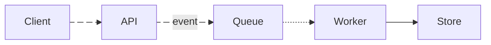

````markdown

````

Two things hold this together. Only the **dash offset** moves — nothing fades
in or appears — so the PDF, which plays no animation and paints the first
frame, shows a plain dashed line and not a blank. And a reader whose system
asks for reduced motion gets the still figure: the theme switches every
animation off under `prefers-reduced-motion`, the author's included.

### Steps: 1, then 2, then 3

A sequence is told by a **highlight that travels**: each step takes the
accent and a heavier stroke for a moment, in order, then the round starts
again. Nothing is hidden and revealed — that would leave the PDF with a blank
where steps 2 and 3 belong — so at rest the figure is the complete diagram.

The theme provides the `diagram-step` animation; a `classDef` per step gives
it its delay, and `class` puts nodes and edges (by their `id@`) on that step —
here, each step lights the arrow and the node it reaches. Cycle = 1.5s ×
number of steps (one more for a pause, if you like); delay of step *k* = 1.5s
× (*k* − 1).

The example is the flowchart from the top of the page, told as a request: a
decision whose **two branches light together** (step 3 holds both the accepted
and the rejected path), a fan-out inside a subgraph (step 4, both stores at
once), and a dotted, asynchronous last hop. The `focal` node is left out of
the steps on purpose: it already wears the accent, and a `classDef` that sets
the stroke with `!important` — as `focal` does — outranks any animation, so a
step on it would show nothing.

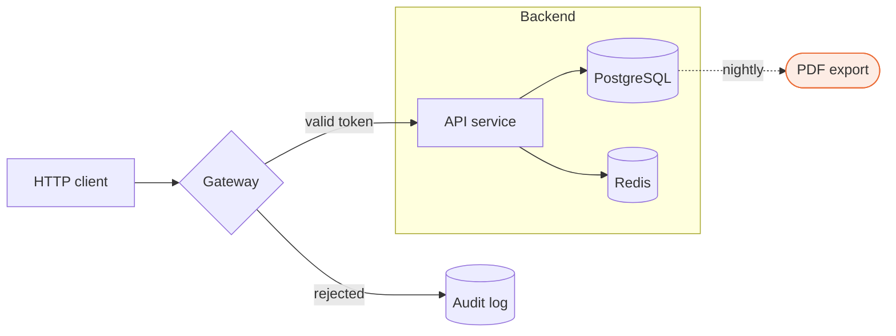

````markdown

````

The steps light in the theme's tangerine accent by default. A `%% steps`
comment with a colour — `%% steps #004494` above, the EU blue — recolours
them for that diagram, which is how this one keeps its steps apart from the
`focal` node; a hex value or a CSS colour name, nothing else, is accepted.
The highlight ramps up over the first 4% of the cycle, holds until 14%, then
leaves at once; on a cycle of up to ten steps that keeps one step lit at a
time, with a beat between two on a short chain. Several elements on one step
is how a branch or a fan-out is told:
they light together. A dotted edge given a step keeps its dashes but not its
drift — the step's animation takes the slot. Mermaid's `classDef` accepts no
comma inside a value, which is why the edge needs an `id@` and a class rather
than a `linkStyle`.

---

## Sequence diagram

For an exchange over time between several participants: API calls,
authentication protocols, service choreography.

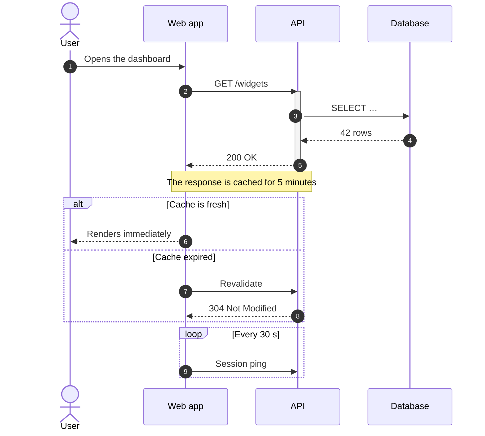

<details>
<summary>Source</summary>

```text
sequenceDiagram
    autonumber
    actor U as User
    participant W as Web app
    participant A as API
    participant D as Database

    U->>W: Opens the dashboard
    W->>A: GET /widgets
    activate A
    A->>D: SELECT …
    D-->>A: 42 rows
    A-->>W: 200 OK
    deactivate A

    Note over W,A: The response is cached for 5 minutes

    alt Cache is fresh
        W-->>U: Renders immediately
    else Cache expired
        W->>A: Revalidate
        A-->>W: 304 Not Modified
    end

    loop Every 30 s
        W->>A: Session ping
    end
```

</details>

The `Note` takes the tangerine accent: it is the one element of a sequence
diagram an author adds *to draw the eye*.

### Steps, in a sequence diagram

A sequence diagram has no `classDef` and no id on a message, so the flowchart
recipe does not apply — and is not needed: the messages are already in order.
One comment, `%% steps`, and each message lights in turn with its label, the
arrow first, the next one a beat later, then the round starts again. The
renderer counts the messages and sets the cycle (1.5s per message, plus one
of rest); `autonumber` puts the step numbers on the page too. Add a colour to
the comment (`%% steps #004494`) to light in something other than the accent.

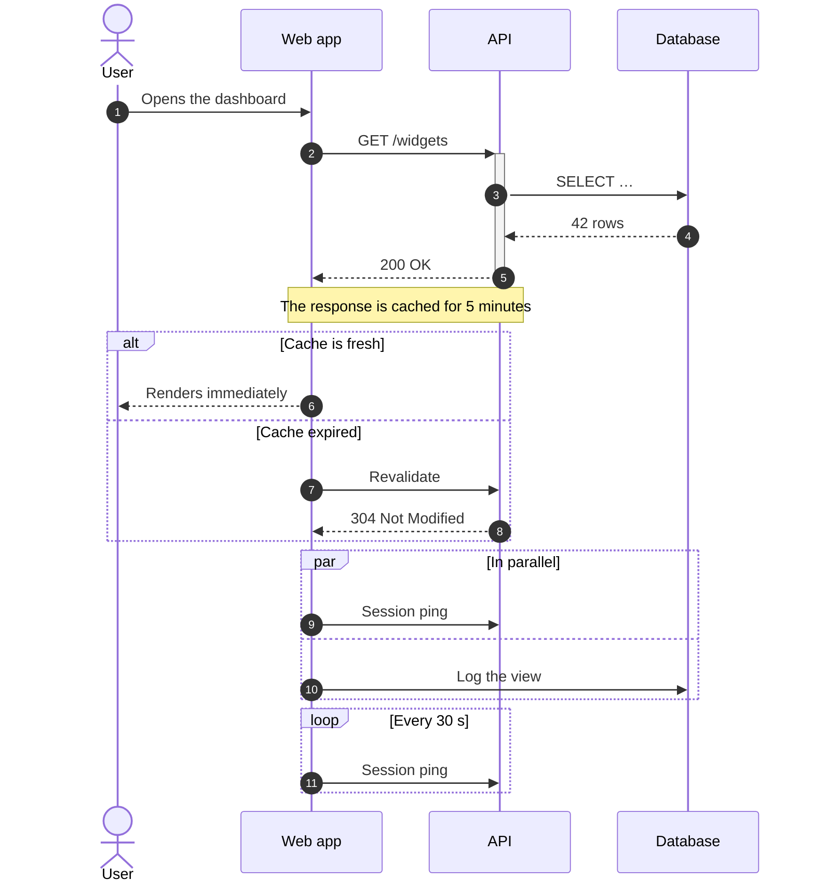

````markdown

````

This is the exchange from the top of the section, with the marker added and
a `par` block for good measure: eleven messages, a round of 18 seconds. The
steps follow the order the messages are *written* in — through the `alt`,
both branches one after the other, then the two `par` legs, then the loop —
which is also the order `autonumber` counts them in, so the number on the
page is the step. Because the renderer knows the count, each step's light is
set in seconds (0.3s in, held to 1.2s, then off), the same on a long round as
on a short one. Notes, blocks and activations sit between the steps without
shifting them. As everywhere else, nothing is hidden: the PDF shows the full
exchange at rest, and `prefers-reduced-motion` stills it.

---

## Class diagram

The structure of an object model: attributes, methods, visibility, inheritance,
composition.

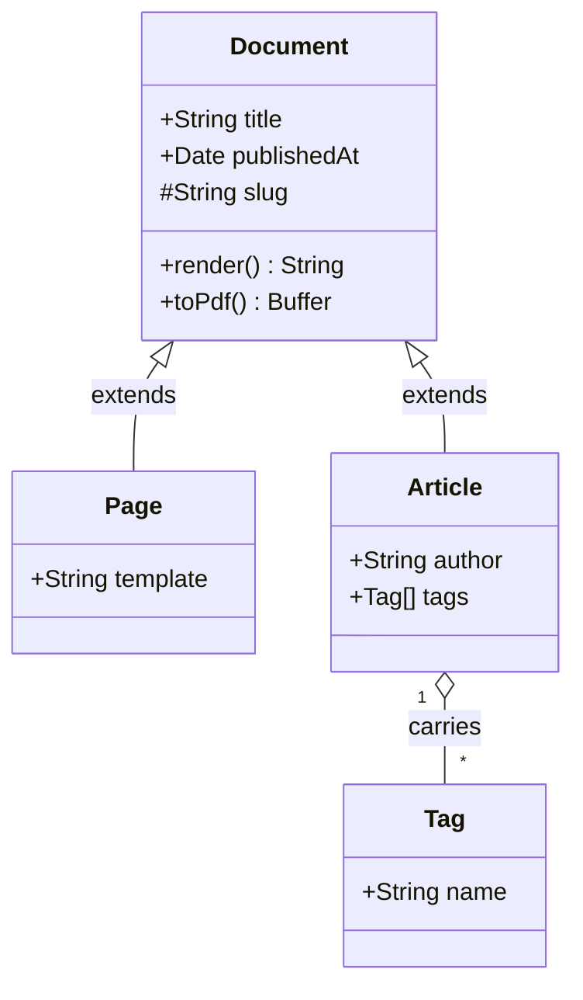

<details>
<summary>Source</summary>

```text
classDiagram
    class Document {
        +String title
        +Date publishedAt
        #String slug
        +render() String
        +toPdf() Buffer
    }

    class Page {
        +String template
    }

    class Article {
        +String author
        +Tag[] tags
    }

    class Tag {
        +String name
    }

    Document <|-- Page : extends
    Document <|-- Article : extends
    Article "1" o-- "*" Tag : carries
```

</details>

---

## State diagram

The life cycle of an entity: which states exist, and which transition moves it
from one to the next.

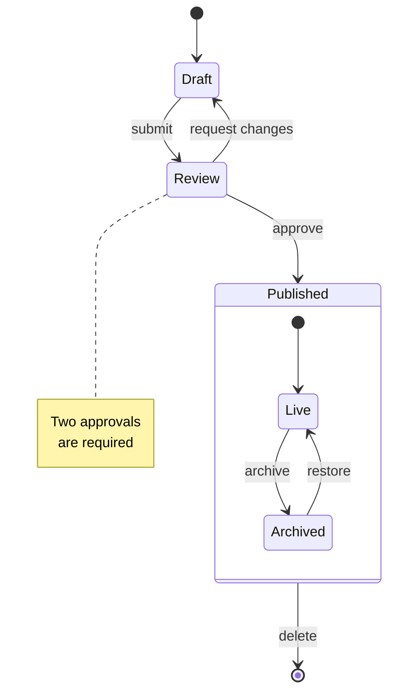

<details>
<summary>Source</summary>

```text
stateDiagram-v2
    [*] --> Draft

    Draft --> Review : submit
    Review --> Draft : request changes
    Review --> Published : approve

    state Published {
        [*] --> Live
        Live --> Archived : archive
        Archived --> Live : restore
    }

    Published --> [*] : delete

    note right of Review
        Two approvals
        are required
    end note
```

</details>

---

## Entity-relationship diagram

A database schema: tables, columns, keys and cardinalities.

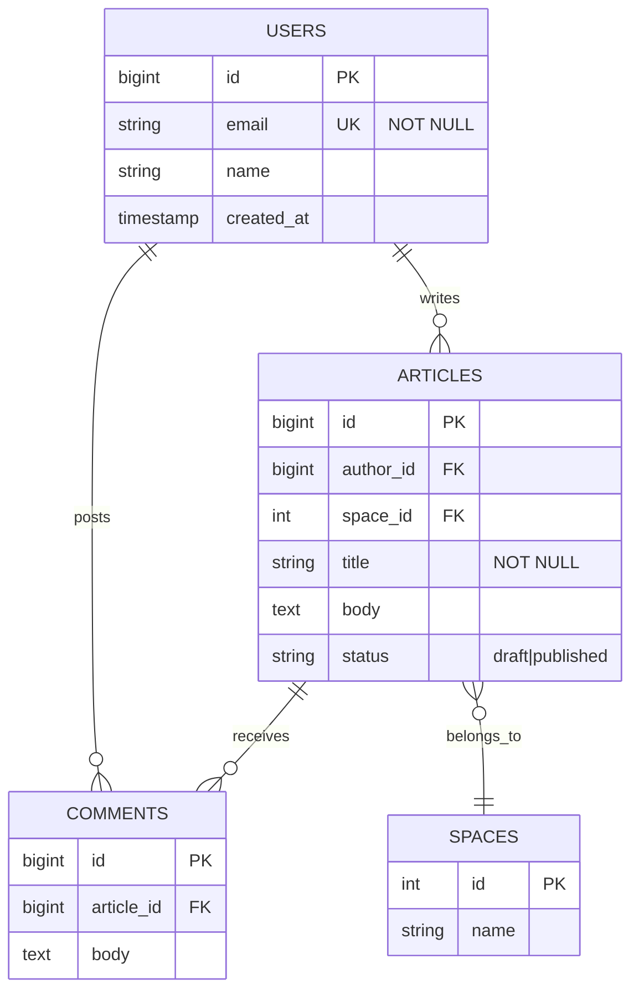

<details>
<summary>Source</summary>

```text
erDiagram
    USERS ||--o{ ARTICLES : writes
    USERS ||--o{ COMMENTS : posts
    ARTICLES ||--o{ COMMENTS : receives
    ARTICLES }o--|| SPACES : belongs_to

    USERS {
        bigint id PK
        string email UK "NOT NULL"
        string name
        timestamp created_at
    }

    ARTICLES {
        bigint id PK
        bigint author_id FK
        int space_id FK
        string title "NOT NULL"
        text body
        string status "draft|published"
    }

    COMMENTS {
        bigint id PK
        bigint article_id FK
        text body
    }

    SPACES {
        int id PK
        string name
    }
```

</details>

---

## Gantt

A schedule: phases, durations, dependencies, critical path. Tasks marked `crit`
take the accent.

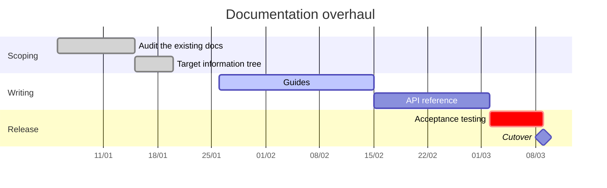

<details>
<summary>Source</summary>

```text
gantt
    title Documentation overhaul
    dateFormat YYYY-MM-DD
    axisFormat %d/%m

    section Scoping
        Audit the existing docs  :done,   a1, 2026-01-05, 10d
        Target information tree  :done,   a2, after a1, 5d

    section Writing
        Guides                   :active, b1, 2026-01-26, 20d
        API reference            :        b2, after b1, 15d

    section Release
        Acceptance testing       :crit,   c1, after b2, 7d
        Cutover                  :milestone, c2, after c1, 0d
```

</details>

---

## Pie chart

A breakdown, when the slices are few and clearly different. The first slice
takes the accent.

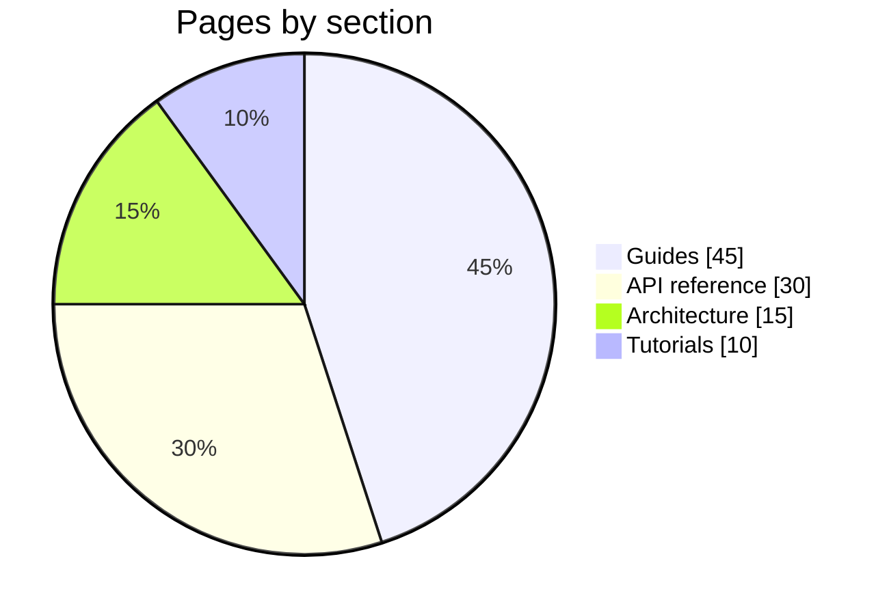

---

## Quadrant

Position options on two axes — effort against value, risk against impact.

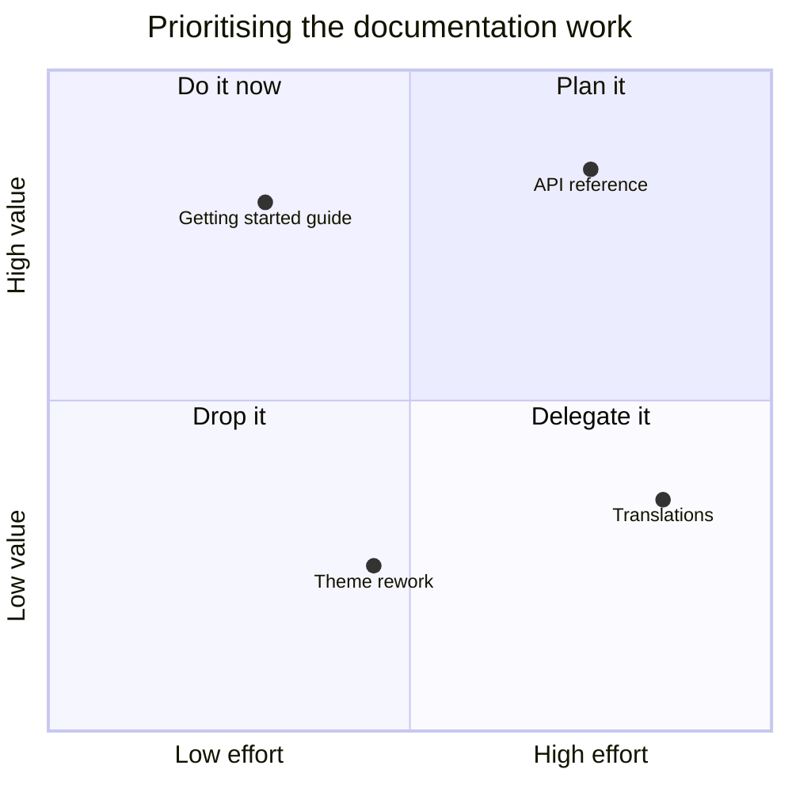

<details>
<summary>Source</summary>

```text
quadrantChart
    title Prioritising the documentation work
    x-axis "Low effort" --> "High effort"
    y-axis "Low value" --> "High value"
    quadrant-1 Plan it
    quadrant-2 Do it now
    quadrant-3 Drop it
    quadrant-4 Delegate it
    "API reference": [0.75, 0.85]
    "Getting started guide": [0.30, 0.80]
    "Translations": [0.85, 0.35]
    "Theme rework": [0.45, 0.25]
```

</details>

---

## Requirement diagram

Trace requirements and what satisfies or verifies them — useful for a compliance
file.

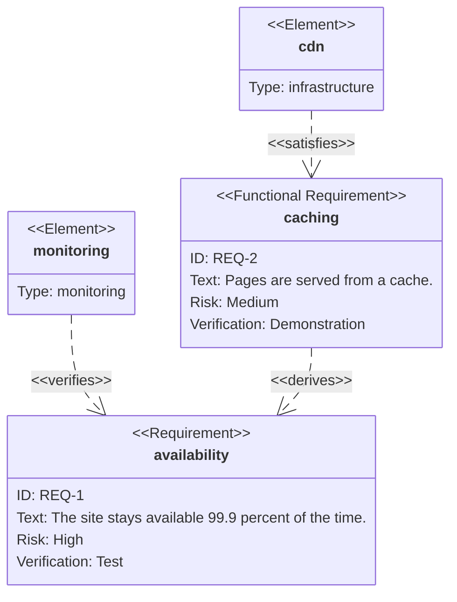

<details>
<summary>Source</summary>

```text
requirementDiagram

requirement availability {
id: "REQ-1"
text: The site stays available 99.9 percent of the time.
risk: high
verifymethod: test
}

functionalRequirement caching {
id: "REQ-2"
text: Pages are served from a cache.
risk: medium
verifymethod: demonstration
}

element monitoring {
type: monitoring
}

element cdn {
type: infrastructure
}

cdn - satisfies -> caching
monitoring - verifies -> availability
caching - derives -> availability
```

</details>

---

## Git graph

A branching strategy, explained by example.

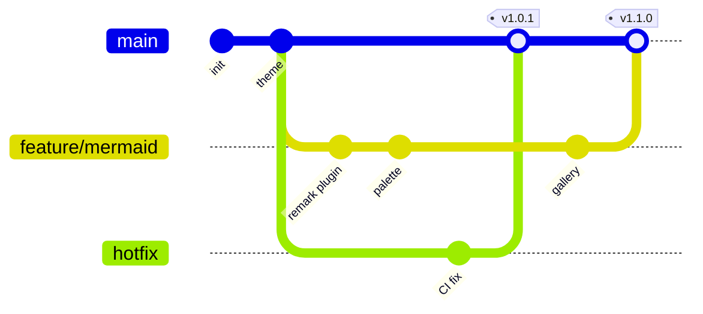

<details>
<summary>Source</summary>

```text
gitGraph
    commit id: "init"
    commit id: "theme"
    branch feature/mermaid
    checkout feature/mermaid
    commit id: "remark plugin"
    commit id: "palette"
    checkout main
    branch hotfix
    commit id: "CI fix"
    checkout main
    merge hotfix tag: "v1.0.1"
    checkout feature/mermaid
    commit id: "gallery"
    checkout main
    merge feature/mermaid tag: "v1.1.0"
```

</details>

---

## C4

The C4 model for architecture: context, containers, components. Useful when you
need to show who talks to what, and over which protocol.

```mermaid
C4Context
    title Documentation portal context

    Person(reader, "Reader", "Reads the documentation")
    Person(author, "Author", "Writes in Markdown")

    System(portal, "Docusaurus portal", "Static site and PDF exports")

    System_Ext(github, "GitHub", "Repository and continuous integration")
    System_Ext(sso, "SSO provider", "Authentication")

    Rel(reader, portal, "Browses", "HTTPS")
    Rel(author, github, "Pushes Markdown", "git")
    Rel(github, portal, "Triggers the build", "Actions")
    Rel(portal, sso, "Delegates authentication", "OIDC")

    UpdateElementStyle(reader, $bgColor="#ffffff", $borderColor="#2d3142", $fontColor="#2d3142")
    UpdateElementStyle(author, $bgColor="#ffffff", $borderColor="#2d3142", $fontColor="#2d3142")
    UpdateElementStyle(portal, $bgColor="#fdece4", $borderColor="#eb6c36", $fontColor="#2d3142")
    UpdateElementStyle(github, $bgColor="#f5f5f5", $borderColor="#bfc0c0", $fontColor="#2d3142")
    UpdateElementStyle(sso, $bgColor="#f5f5f5", $borderColor="#bfc0c0", $fontColor="#2d3142")

    UpdateRelStyle(reader, portal, $textColor="#4f5d75", $lineColor="#4f5d75", $offsetY="-20")
    UpdateRelStyle(author, github, $textColor="#4f5d75", $lineColor="#4f5d75", $offsetY="-20")
    UpdateRelStyle(github, portal, $textColor="#4f5d75", $lineColor="#4f5d75", $offsetY="-30", $offsetX="-60")
    UpdateRelStyle(portal, sso, $textColor="#4f5d75", $lineColor="#4f5d75", $offsetY="-20")
```

<details>
<summary>Source</summary>

```text
C4Context
    title Documentation portal context

    Person(reader, "Reader", "Reads the documentation")
    Person(author, "Author", "Writes in Markdown")

    System(portal, "Docusaurus portal", "Static site and PDF exports")

    System_Ext(github, "GitHub", "Repository and continuous integration")
    System_Ext(sso, "SSO provider", "Authentication")

    Rel(reader, portal, "Browses", "HTTPS")
    Rel(author, github, "Pushes Markdown", "git")
    Rel(github, portal, "Triggers the build", "Actions")
    Rel(portal, sso, "Delegates authentication", "OIDC")

    UpdateElementStyle(reader, $bgColor="#ffffff", $borderColor="#2d3142", $fontColor="#2d3142")
    UpdateElementStyle(author, $bgColor="#ffffff", $borderColor="#2d3142", $fontColor="#2d3142")
    UpdateElementStyle(portal, $bgColor="#fdece4", $borderColor="#eb6c36", $fontColor="#2d3142")
    UpdateElementStyle(github, $bgColor="#f5f5f5", $borderColor="#bfc0c0", $fontColor="#2d3142")
    UpdateElementStyle(sso, $bgColor="#f5f5f5", $borderColor="#bfc0c0", $fontColor="#2d3142")

    UpdateRelStyle(reader, portal, $textColor="#4f5d75", $lineColor="#4f5d75", $offsetY="-20")
    UpdateRelStyle(author, github, $textColor="#4f5d75", $lineColor="#4f5d75", $offsetY="-20")
    UpdateRelStyle(github, portal, $textColor="#4f5d75", $lineColor="#4f5d75", $offsetY="-30", $offsetX="-60")
    UpdateRelStyle(portal, sso, $textColor="#4f5d75", $lineColor="#4f5d75", $offsetY="-20")
```

</details>

C4 only partly inherits the site theme: Mermaid hardcodes its blues there, and
the theme can reclaim only a few keys. The `UpdateElementStyle` and
`UpdateRelStyle` directives above do the rest — and that is also how you mark
the focal system, here the portal, in tangerine. Only the person pictogram keeps
its original blue.

---

## Mind map

To rough out a scope, or give the plan of a site at a glance.

```mermaid
mindmap
    root((Documentation))
        Guides
            Getting started
            Installation
            Troubleshooting
        Reference
            REST API
            CLI
            Environment variables
        Architecture
            Context
            Containers
            Decisions
        Publishing
            Static site
            PDF exports
```

---

## Timeline

```mermaid
timeline
    title Portal history
    2023 : First Markdown files in the repository
    2024 : Moved to Docusaurus
         : Automated PDF exports
    2025 : Diagrams rendered at build time
         : Local search
    2026 : One theme for site and PDF
```

---

## Sankey

Flows and their volumes: where traffic comes from, where it drops off.

```mermaid
sankey-beta

"Search","Home",1200
"Direct","Home",600
"Social","Home",240
"Home","Guides",900
"Home","Reference",640
"Home","Exit",500
"Guides","Reference",320
"Guides","Exit",580
"Reference","Exit",960
```

---

## XY chart

Bars and lines on the same axes, for a numeric series.

```mermaid
xychart-beta
    title "Page views per month"
    x-axis ["jan", "feb", "mar", "apr", "may", "jun"]
    y-axis "Thousands of views" 0 --> 60
    bar [12, 18, 24, 31, 44, 52]
    line [12, 18, 24, 31, 44, 52]
```

---

## Block

A grid layout, for when position matters more than links: architecture layers,
the regions of a screen.

```mermaid
block-beta
    columns 3

    browser["Browser"]:3
    space:3
    cdn["CDN"] api["API"] static["Static files"]
    space:3
    db[("PostgreSQL")]:3
```

<details>
<summary>Source</summary>

```text
block-beta
    columns 3

    browser["Browser"]:3
    space:3
    cdn["CDN"] api["API"] static["Static files"]
    space:3
    db[("PostgreSQL")]:3
```

</details>

---

## Packet

The binary layout of a header or a frame, bit by bit.

```mermaid
packet-beta
    0-15: "Source port"
    16-31: "Destination port"
    32-63: "Sequence number"
    64-95: "Acknowledgement number"
    96-99: "Offset"
    100-105: "Reserved"
    106-111: "Flags"
    112-127: "Window"
```

---

## Kanban

The state of a work board, frozen into the documentation.

```mermaid
kanban
    To do
        t1[Translate the guides]
        t2[Document the CLI]
    In progress
        t3[Diagram gallery]
    Done
        t4[Unified theme]
        t5[PDF exports]
```

---

## Architecture

Services and groups, with the built-in icons (`cloud`, `database`, `disk`,
`internet`, `server`).

```mermaid
architecture-beta
    group public(internet)[Public]
    group private(cloud)[Private]

    service browser(internet)[Browser] in public
    service cdn(server)[CDN] in public
    service api(server)[API] in private
    service db(database)[PostgreSQL] in private
    service files(disk)[Object storage] in private

    browser:R --> L:cdn
    cdn:R --> L:api
    api:R --> L:db
    api:B --> T:files
```

<details>
<summary>Source</summary>

```text
architecture-beta
    group public(internet)[Public]
    group private(cloud)[Private]

    service browser(internet)[Browser] in public
    service cdn(server)[CDN] in public
    service api(server)[API] in private
    service db(database)[PostgreSQL] in private
    service files(disk)[Object storage] in private

    browser:R --> L:cdn
    cdn:R --> L:api
    api:R --> L:db
    api:B --> T:files
```

</details>

Edges and group frames follow the theme; the **icons** come from Mermaid's own
icon set and keep their blue. That is the only place on this page where a colour
escapes the system.

---

## Radar

Compare several profiles against the same criteria.

```mermaid
radar-beta
    axis clarity["Clarity"], freshness["Freshness"], coverage["Coverage"]
    axis examples["Examples"], search["Search"]
    curve before["Before the overhaul"]{60, 40, 55, 30, 45}
    curve after["After the overhaul"]{85, 80, 75, 90, 80}
    max 100
```

<details>
<summary>Source</summary>

```text
radar-beta
    axis clarity["Clarity"], freshness["Freshness"], coverage["Coverage"]
    axis examples["Examples"], search["Search"]
    curve before["Before the overhaul"]{60, 40, 55, 30, 45}
    curve after["After the overhaul"]{85, 80, 75, 90, 80}
    max 100
```

</details>

---

## Treemap

Nested proportions: the weight of each section, and what it is made of.

```mermaid
treemap-beta
    "Documentation"
        "Guides"
            "Getting started": 18
            "Installation": 12
            "Troubleshooting": 9
        "Reference"
            "REST API": 22
            "CLI": 8
        "Architecture"
            "Decisions": 14
            "C4 views": 6
```

<details>
<summary>Source</summary>

```text
treemap-beta
    "Documentation"
        "Guides"
            "Getting started": 18
            "Installation": 12
            "Troubleshooting": 9
        "Reference"
            "REST API": 22
            "CLI": 8
        "Architecture"
            "Decisions": 14
            "C4 views": 6
```

</details>

---

## ZenUML

A second sequence syntax, closer to code — handy when the diagram is derived
from an implementation.

```mermaid
zenuml
    title Creating an article
    @Actor Author
    @Boundary API
    @Database Store

    Author->API.create(article) {
        API->Store.insert(article) {
            return id
        }
        return 201
    }
```

<details>
<summary>Source</summary>

```text
zenuml
    title Creating an article
    @Actor Author
    @Boundary API
    @Database Store

    Author->API.create(article) {
        API->Store.insert(article) {
            return id
        }
        return 201
    }
```

</details>

---

## Pipeline limits

Four things worth knowing before writing a diagram here. They all follow from
one choice: a single SVG serves the site **and** the PDF.

### The user journey (`journey`) is not usable

It is the only type Mermaid renders with `<foreignObject>` elements — HTML
placed inside the SVG. WeasyPrint cannot render those: the diagram comes out of
the PDF with empty boxes and no text at all. Every other type honours the
`htmlLabels: false` setting and stays in SVG `<text>`. For a journey, use a
timeline or a state diagram instead.

### Some labels overflow their box

On entity-relationship, class and state diagrams, a long label can slightly
overrun its frame. This is a known limitation of `htmlLabels: false`, a setting
the PDF forces on us. The workaround is to shorten the label, or move part of it
into a note.

### Colours are set in the theme, not in the diagram

Site CSS cannot reach inside a diagram: the SVG is inlined in an ``, which
CSS does not cross. The whole palette therefore lives in
`src/remark/mermaid-theme.mjs`. A diagram's own `style` and `classDef`
directives remain available for a one-off — see the `classDef focal` in the
first example — but anything systematic belongs in the theme.

### One accent per diagram

The theme reserves tangerine for elements that are focal by construction: notes,
critical tasks, the first slice of a pie. A diagram that highlights everything
highlights nothing: two accented nodes at most.

## When a diagram fails to render

The build does not stop: the block is replaced by a visible box that keeps the
source and shows the error. Search the build log for `[mermaid]` to find the
cause. To fail the build instead — useful in CI — run it with
`MERMAID_STRICT=1`.
