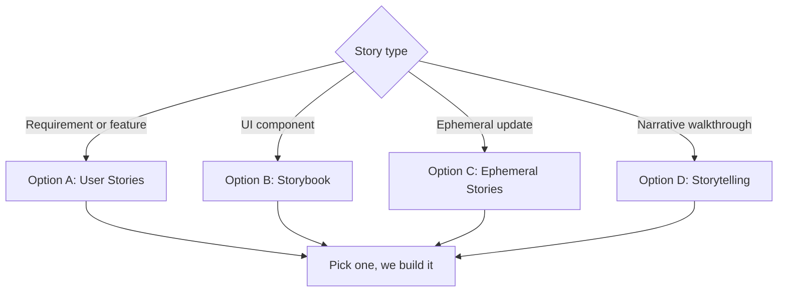

# Story System — Proposal

The phrase **"story system"** can mean several very different things. Rather than
guess, this page lays out **four concrete options** for what a story system could
be in this Docusaurus site. Each is self-contained: read them, then **pick one**
and we build it out.

:::tip How to use this page
Skim the **At a glance** table, look at the **decision map**, then jump to the
option that fits. Every option ends with an honest *effort* estimate and
*trade-offs*.
:::

## At a glance

| # | Option | What it is | Effort | Best when you want… |
|---|--------|-----------|:------:|----------------------|
| **A** | **User Stories (agile)** | Structured product/agile stories in the docs | ★★☆☆☆ | Traceable requirements linked to the architecture |
| **B** | **Storybook (UI components)** | Interactive catalog of React component "stories" | ★★★☆☆ | A living UI component library / design system |
| **C** | **Ephemeral Stories (social-style)** | Instagram/WhatsApp-style time-limited stories | ★★★★☆ | Lightweight, expiring announcements/updates |
| **D** | **Storytelling / Scrollytelling** | Guided, narrative doc journeys | ★★★☆☆ | High-impact landing/onboarding narratives |

## Decision map

---

## Option A — User Stories (agile)

A system to **write, structure and trace user stories** directly in the
documentation, tied back to the architecture (arc42 / MADR) already in this site.

**How it works here**
- A `docs/stories/` section, one Markdown file per story, using a shared template
  (`As a … I want … so that …` + acceptance criteria).
- A reusable **`<Story>`** MDX component that renders a story card with metadata
  (id, actor, priority, status, linked ADRs/components).
- Cross-links to architecture pages; optional roll-up index (status board).

**Key features**
- Consistent template + front-matter (id, status, priority, epic).
- Auto-generated **story index** and status board.
- Traceability: story ↔ architecture decision ↔ building block.

**Effort:** ★★☆☆☆ — mostly a template + one MDX component + a category.

**Trade-offs**
- ✅ Low effort, fits the existing docs model, great for requirement traceability.
- ✅ Renders in the PDF export too (static content).
- ➖ Not interactive; it's documentation, not a live tracker (no Jira sync).

---

## Option B — Storybook (UI component stories)

Integrate **Storybook** so each React component has interactive **stories**
(variants, states, props playground) — a living design-system reference.

**How it works here**
- Add Storybook alongside Docusaurus; publish the static Storybook build.
- Link component docs pages to their Storybook stories (and vice-versa).
- Optionally embed a story in an MDX page via an `<iframe>`.

**Key features**
- Interactive component catalog with controls/args.
- Visual variants, accessibility checks, and isolated component dev.
- A single source of truth for the UI kit.

**Effort:** ★★★☆☆ — new toolchain + CI job to build/publish Storybook.

**Trade-offs**
- ✅ Best-in-class for UI component documentation and dev workflow.
- ➖ Second build system to maintain; **interactive-only** → does **not** appear
  in the WeasyPrint PDF (JavaScript-driven).
- ➖ Overkill if the site is mostly prose/architecture docs.

---

## Option C — Ephemeral Stories (social-media style)

A lightweight **"stories" bar** (à la Instagram/WhatsApp): tappable, full-screen,
**time-limited** cards for announcements, release notes, or "what's new".

**How it works here**
- A JSON/MDX-backed list of story items with a `publishedAt` / `expiresAt`.
- A React component rendering a top **stories row**; click → full-screen viewer
  with auto-advance and progress bars.
- Items auto-hide after expiry (client-side).

**Key features**
- Circular avatars → full-screen story viewer (tap/keyboard to advance).
- Expiry, "seen" state (localStorage), light/dark aware.
- Perfect for ephemeral "news" without cluttering the docs.

**Effort:** ★★★★☆ — custom interactive component + viewer + state; most bespoke UI.

**Trade-offs**
- ✅ Eye-catching, modern, great for announcements/engagement.
- ➖ Purely client-side & ephemeral → **not** in the PDF, not archival.
- ➖ Highest build effort; UX details (gestures, a11y) take care.

---

## Option D — Storytelling / Scrollytelling docs

Turn selected pages into **guided narratives**: as the reader scrolls, visuals
(diagrams, code, images) update in sync — ideal for onboarding or an
"architecture tour".

**How it works here**
- A `<Scrollytelling>` MDX component: a sticky visual pane + scrolling steps.
- Reuse the site's **Mermaid/PlantUML** diagrams (now rendered at build time) as
  the visuals that swap per step.
- Great as a landing/onboarding "start here" journey.

**Key features**
- Sticky visual + step-synced narration (scroll-driven).
- Reuses existing diagram pipeline (Mermaid/PlantUML → inline SVG).
- Strong first-impression / onboarding impact.

**Effort:** ★★★☆☆ — one scroll-sync component + authoring conventions.

**Trade-offs**
- ✅ High narrative impact; reuses what we just built (build-time diagrams).
- ➖ Scroll interactivity is web-only (the PDF gets a static fallback).
- ➖ Content-heavy to author well.

---

## Recommendation

If the goal is **documentation value with the least effort and full PDF support**,
**Option A (User Stories)** is the natural fit for this arc42/MADR site — it slots
into the existing docs model and stays in the PDF export.

If the goal is a **modern, engaging feature**, **Option D (Storytelling)** gives
the best impact-to-effort ratio and reuses the diagram pipeline we just added.

**Options B and C** are excellent but pull in a second build system (B) or a fully
bespoke client-side UI (C) — pick them only if that specific capability is the
actual goal.

:::note Next step
Tell me which option (A / B / C / D) — I'll turn the chosen one into a working
implementation on its own branch.
:::
